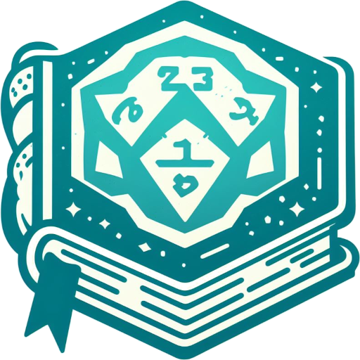

# 5e DM Tools

A set of tools to help a Dungeon Master for 5th Edition D&D.

## Features

- Creature creator
  - Add, Edit, your own custom creatures
- Initiative Tracker
  - Track your combat encounter and whose turn it is
  - Automatically roll your creatures in an encounter
  - Add your players
  - See what your creatures can do
  - Track your creatures who are dead and their HP

## Installation

TODO: Will be followed up on release

## Contribution

### Reporting Issues / Feature Requests

You can report issues via the [issues tracker](https://github.com/TJCowx/5e-dm-tools/issues).

### Development

You may contribute by adding features, bugfixes, or documentation. Contributing guide will be eventually made

**To run your development server**

```bash
# Install Dependencies
npm install

# Build NextJS // This only needs to be ran once
npm run next:build

# Run development server
npm run dev
```

## License


